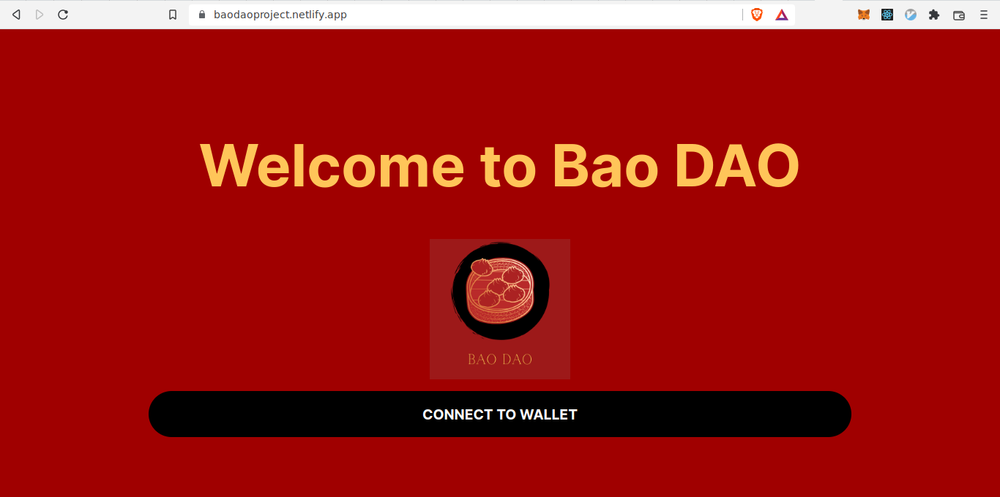

# Build my own DAO with just Javascript

### **Welcome**

This is a project to lear how to build a DAO with a governance token and shared NFT
You can check the page for this project at: [baodao](https://baodaoproject.netlify.app/)

Is based on the course of [BuildSpace](https://buildspace.so/)

To get started with this project, clone this repo and follow these commands:

1. Run `npm install` at the root of your directory
2. Run `npm start` to start the project
3. Start coding!

### **Author**
Louvani is a Software Engineer passionate about challenges that allow me to keep growing by learning and experimenting with new technologies.
- [Louvani](https://github.com/louvani)
- [Portfolio](https://louuvani.com)
- [twitter](https://twitter.com/PaulaLouvani)
- [linkedIn](https://www.linkedin.com/in/paula-louvani//)

